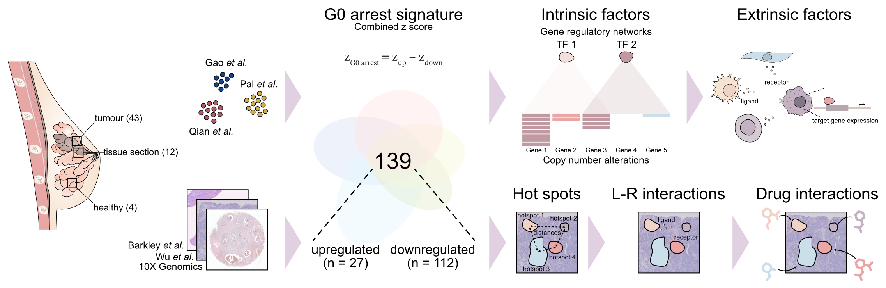

# G0 Breast Cancer Atlas 

### Author: Cenk Celik, UCL Genetics Institute
This repository contains scripts for the evaluation of intrinsic and extrinsic regulation of G0 cell cycle arrest in breast cancer using single-cell and spatial transcriptomics data.

## Integrating public data

Scripts in [00_IntegratingDatasets](00_IntegratingDatasets) describe how to [download and preprocess](00_IntegratingDatasets/01_CreateObjectsFromPublicData.R) publicly available data, integrate them using [`SCTransform` v2](00_IntegratingDatasets/02_IntegrateDatasetswithSCTransform.R), annotate cell types using marker gene expressions from the [`PanglaoDB`](https://panglaodb.se). The full cell type annotation database can be download from the [link](https://panglaodb.se/markers/PanglaoDB_markers_27_Mar_2020.tsv.gz). Using the full cell type database, generate the input for scAnnotate [here](00_IntegratingDatasets/03_a_CreateAnnotationDatabase.R). Make sure to also download helper function [1](00_IntegratingDatasets/03_a1_gene_sets_prepare.r) and [2](00_IntegratingDatasets/03_a1_gene_sets_prepare.R) during cell type [annotation](00_IntegratingDatasets/03_b_AnnotateIntegratedDataset.R). Since, the `PanglaoDB` do not have cancer associated fibroblast markers, we checked for this separately in [04_IdentifyingCancerAssociatedFibroblasts](00_IntegratingDatasets/04_IdentifyingCancerAssociatedFibroblasts.R).

## Inferring copy number alterations

We leveraged [`infercnv` package](https://github.com/broadinstitute/infercnv) to [infer](01_InferCNV/01_InferCopyNumberVariations.R) copy number variations in epithelial single cells.

## G0 arrest scoring in malignant cells

First, apply combined G0 arrest scoring method using the gene sets [downregulated_common.RData](02_G0arrestInMalignantCells/data/downregulated_common.RData) and [upregulated_common.RData](02_G0arrestInMalignantCells/data/upregulated_common.RData).
> **Note:** if the data has ENSEMBL ID rather than HGNC symbols, visit the original study by [Wiecek *et al.* 2023](https://github.com/secrierlab/CancerG0Arrest) for the appropriate gene sets.

To evaluate pathway enrichment in malignant cells based on their cell cycle status, use [02_EnrichmentAnalysis](02_G0arrestInMalignantCells/02_EnrichmentAnalysis.R). One could use [03_DifferentialAbundanceTesting](02_G0arrestInMalignantCells/03_DifferentialAbundanceTesting.R), [04_DifferentialExpression](02_G0arrestInMalignantCells/04_DifferentialExpression.R) to compute differential abundance and gene expresssion per cell cycle state, and [05_GeneExpression](02_G0arrestInMalignantCells/05_GeneExpression.R) to plot genes of interest.

## Cell-cell interactions

Cell-cell interaction analysis was conducted at two levels:

i. [Ligand-target cell gene expression](03_CellCellInteractions/01_NicheNetAnalysis.R): Using [`NicheNet` v2.0](https://github.com/saeyslab/nichenetr/tree/master), infer prioritised ligands from the tumour microenvironment (TME).

ii. [Ligand-receptor interactions](03_CellCellInteractions/02_CellPhoneDBanalysis.py): Using [`CellPhoneDB` v5 (method 3)](https://cellphonedb.readthedocs.io/en/latest/), evaluate specific ligand-receptor pairs between the TME and cell type of interest.

## Exhausted T cells

We utilised [`ProjecTILs` package](https://github.com/carmonalab/ProjecTILs) along with an extensive [human CD8 T cell atlas](https://doi.org/10.6084/m9.figshare.23608308) to [identify T cell states](04_InvestigatingCD8TcellExhaustion/01_CD8TcellExhaustion.R[) and infer their interactions with the TME, in particular, G0 arrested and fast-cycling cells, using [NicheNet](04_InvestigatingCD8TcellExhaustion/02_CellCellInteractionsInCD8Tcells.R) and [CellPhoneDB](04_InvestigatingCD8TcellExhaustion/03_TexCellPhoneDB.py).

## Gene regulatory networks

We used python implementation of [`SCENIC`](https://pyscenic.readthedocs.io/en/latest/) to investigate gene regulatory networks in [G0 arrest](05_GeneRegulatoryNetworks/01_G0_arrested_gene_regulatory_networks.py), [fast-cycling](05_GeneRegulatoryNetworks/02_Fast_cycling_gene_regulatory_networks.py) and [slow-cycling](05_GeneRegulatoryNetworks/03_Slow_cycling_gene_regulatory_networks.py) cells. Make sure you have your dataset in AnnData format. See [00_data_preparation.py](05_GeneRegulatoryNetworks/00_data_preparation.py). For the module enrichment in fast-cycling cells use [04_module_enrichment.R](05_GeneRegulatoryNetworks/04_module_enrichment.R). For detailed interrogation of the [proteostasis network](05_GeneRegulatoryNetworks/05_robust_rank_analysis_gsea.R) and [senescence/dormancy](05_GeneRegulatoryNetworks/06_senescence_dormancy_density.R), we employed [Robust rank Analysis](https://github.com/chuiqin/irGSEA).

## Tumour subclones

Using [`SCEVAN`](https://github.com/AntonioDeFalco/SCEVAN), we calculated [tumour subclones](06_TumourClones/01_TumourClones.R) for cells of interest.

## Spatial analyses

Using 12 [Visium breast cancer slides](https://zenodo.org/records/10371890), we computed distances between niches using [`SpottedPy`](https://github.com/secrierlab/SpottedPy/tree/main) and estimated [L_R interactions](07_SpatialAnalysis/04_SpatialCellPhoneDB.py) using [`LIANA+`](https://liana-py.readthedocs.io/en/latest/) [`cellphonedb`](https://cellphonedb.readthedocs.io/en/latest/) implementation. Also, we calculated distances between G0 and fast cycling states for [signatures](07_SpatialAnalysis/02_SpottedPySignatures.py and 07_SpatialAnalysis/03_SpottedPyUPRSignatures.py). Entire workflow can be found [here](07_SpatialAnalysis/).

## Single cell large language model

The [G0-LM model](https://github.com/secrierlab/G0-LM), adapted from scBERT, integrates advanced fine-tuning techniques like LoRA to address G0 arrest in single-cell analysis, leveraging attention-enhanced embeddings and a fusion network for precise cell state classification. By amplifying signals from key genes and filtering irrelevant features, it delivers accurate predictions while minimizing overfitting.

## Drug-niche interactions

We employed [`drug2cell`](https://drug2cell.readthedocs.io) on Visium slides to find candidate molecules for [niches of interest](09_DrugNicheInteractions/01_DrugNichePredictions.py). Then, we computed distances between [the niches and candidate molecules](09_DrugNicheInteractions/02_DrugNicheSpottedPyAnalysis.py).

## Survival (KM) analysis

Finally, we also tested survival in [METABRIC](https://www.cbioportal.org/study/summary?id=brca_metabric) breast cancer cohort for the ER+ and TNBC subtypes using our [G0 arrest scoring](https://github.com/secrierlab/CancerG0Arrest) method in [bulk tumours](10_SurvivalAnalysis/01_METABRIC_survival_test_adjusted_curves.R).

# How to cite

Celik, C., Withnell, E., Chu, T., Pan, S., Labbadia, J., & Secrier, M. (2024). Balancing tumour proliferation and sustained cell cycle arrest through proteostasis remodelling drives immune niche compartmentalisation in breast cancer. [Preprint].

# Copyright
This code is free and is distributed in the hope that it will be useful, but WITHOUT ANY WARRANTY. See the GNU General Public License for more details.
