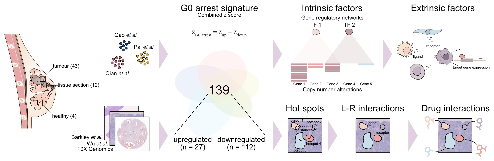

# G0 Breast Cancer Atlas 

### Author: Cenk Celik, UCL Genetics Institute
This repository contains scripts for the evaluation of intrinsic and extrinsic regulation of G0 cell cycle arrest in breast cancer using single-cell and spatial transcriptomics data.

## Integrating public data

Scripts in [00_IntegratingDatasets](00_IntegratingDatasets) describe how to [download and preprocess](00_IntegratingDatasets/01_CreateObjectsFromPublicData.R) publicly available data, integrate them using [`SCTransform` v2](00_IntegratingDatasets/02_IntegrateDatasetswithSCTransform.R), annotate cell types using marker gene expressions from the [`PanglaoDB`](https://panglaodb.se). The full cell type annotation database can be download from the [link](https://panglaodb.se/markers/PanglaoDB_markers_27_Mar_2020.tsv.gz). Using the full cell type database, generate the input for scAnnotate [here](00_IntegratingDatasets/03_a_CreateAnnotationDatabase.R). Make sure to also download helper function [1](00_IntegratingDatasets/03_a1_gene_sets_prepare.r) and [2](00_IntegratingDatasets/03_a1_gene_sets_prepare.R) during cell type [annotation](00_IntegratingDatasets/03_b_AnnotateIntegratedDataset.R). Since, the `PanglaoDB` do not have cancer associated fibroblast markers, we checked for this separately in [04_IdentifyingCancerAssociatedFibroblasts](00_IntegratingDatasets/04_IdentifyingCancerAssociatedFibroblasts.R).

## Inferring copy number alterations

We leveraged [`infercnv` package](https://github.com/broadinstitute/infercnv) to [infer](01_InferCNV/01_InferCopyNumberVariations.R) copy number variations in epithelial single cells.

## G0 arrest scoring in malignant cells

First, apply combined scoring using tumour-specific [G0 arrest signature](data/G0_signature.xlsx) we [derived](revisions/11_oren_non_cycling.ipynb) from the dataset of [Oren et al (2021) Nature](https://www.nature.com/articles/s41586-021-03796-6). Determine the cut-offs for G0 and cycling phenotypes using [EdU proxy scoring](revisions/01_01_G0_cut_offs.ipynb). We further validated the cell cycle categories with [ccAF_v2](revisions/01_02_validation_external_tool.ipynb) of [Plaisier lab](https://github.com/plaisier-lab/ccAFv2_py). The pathway enrichment analyses for cell cycle states can be found [here](revisions/05_gene_ontology.ipynb). The DEGs for G0, cycling and intermediate is computed using [`scanpy`'s `rank_gene_groups()` function](revisions/25_cycling_states_degs.ipynb). Hallmark pathway analysis, data qc, cell type percentages and subtype and patient-specific G0 proportions can be found [here](revisions/17_cancer_hallmarks.ipynb) and [here](revisions/13_cycling_states_per_patient.ipynb), respectively. Validation of tumour-specific G0 score in cell lines can be found [here](revisions/07_cellline_cutoffs.ipynb). Further supplementary analyses [here](revisions/01_03_G0_score_vs_non_cycling.ipynb).

## Cell-cell interactions

Cell-cell interaction analysis was conducted at two levels:

i. [Ligand-target cell gene expression](revisions/08_01_nichenet_analysis_discovery_invasive.r): Using [`NicheNet` v2.0](https://github.com/saeyslab/nichenetr/tree/master), infer prioritised ligands from the tumour microenvironment (TME). Refer [here](revisions/08_04_ligand_expression.ipynb) for ligand expression for G0 arrest and cycling cells along with celltype specific gene expression dot plot.

ii. [Ligand-receptor interactions](revisions/09_liana_analysis.ipynb): Using [`CellPhoneDB` v5 (method 3)](https://cellphonedb.readthedocs.io/en/latest/), evaluate specific ligand-receptor pairs between the TME and cell type of interest along with [a global LR map](revisions/10_cellphonedb_analysis.ipynb).

[Spatial LR analyses](revisions/16_04_spatial_liana_analysis.ipynb) were conducted in a similary way. LR pairs were [scored and visualised](revisions/19_enrichmap.ipynb) using our [EnrichMap](https://github.com/secrierlab/enrichmap) tool.

## Gene regulatory networks

We used python implementation of [`SCENIC`](https://pyscenic.readthedocs.io/en/latest/) to investigate gene regulatory networks in [G0 arrest, cycling and intermediate](revisions/02_gene_regulatory_network_analysis.ipynb) cells along with [hotspot](revisions/14_hotspot_modules.ipynb) analysis for gene expression modules. For detailed interrogation of the [proteostasis network](05_GeneRegulatoryNetworks/05_robust_rank_analysis_gsea.R) and [senescence/dormancy](05_GeneRegulatoryNetworks/06_senescence_dormancy_density.R), we employed [Robust rank Analysis](https://github.com/chuiqin/irGSEA). [Pathway enrichment](revisions/18_reactoma_pa.ipynb) was also conducted using Reactome and GO databases.

## Tumour subclones

We computed [cell cycle related CNAs burden and intratumour heterogeneity](revisions/06_01_evolution_of_subclones.ipynb) using infercnv results.

## Spatial analyses

Using 12 [Visium breast cancer slides](https://zenodo.org/records/10371890), we computed [distances](revisions/15_00_spottedpy.ipynb) between niches using [`SpottedPy`](https://github.com/secrierlab/SpottedPy), along with subtype specific analyses for [Luminal A](revisions/15_01_spottedpy_LumA.ipynb) and [Basal-like](revisions/15_03_spottedpy_Basal.ipynb) tumours.

## Single-cell large language model

The [G0-LM model](https://github.com/secrierlab/G0-LM), adapted from scBERT, integrates advanced fine-tuning techniques like LoRA to address G0 arrest in single-cell analysis, leveraging attention-enhanced embeddings and a fusion network for precise cell state classification. By amplifying signals from key genes and filtering irrelevant features, it delivers accurate predictions while minimizing overfitting.

## Drug-niche interactions

We employed [`drug2cell`](https://drug2cell.readthedocs.io) on Visium slides to find candidate molecules for [niches of interest](revisions/24_02_spatial_drug_to_cell_predictions.ipynb). Then, we computed distances between [the niches and candidate molecules](revisions/24_03_spatial_drug_to_cell_predictions_spottedpy.ipynb).

## Survival (KM) analysis

Finally, we also tested survival in [METABRIC](https://www.cbioportal.org/study/summary?id=brca_metabric) breast cancer cohort for the ER+ and TNBC subtypes using our [G0 arrest scoring](https://github.com/secrierlab/CancerG0Arrest) method in [bulk tumours](10_SurvivalAnalysis/01_METABRIC_survival_test_adjusted_curves.R).

## Validation and complementary analyses
- Prediction of [Ki67 expression](revisions/04_predict_ki67_expression.ipynb) from H&E images
- [Validation of spatial](revisions/23_01_xenium_distances.ipynb) findings in Xenium data with [LR analysis](revisions/23_02_xenium_liana.ipynb)

# How to cite

Celik, C., Withnell, E., Chu, T., Pan, S., Labbadia, J., & Secrier, M. (2024). Balancing tumour proliferation and sustained cell cycle arrest through proteostasis remodelling drives immune niche compartmentalisation in breast cancer. [Preprint](https://doi.org/10.1101/2025.01.08.632014).

# Copyright
This code is free and is distributed in the hope that it will be useful, but WITHOUT ANY WARRANTY. See the GNU General Public License for more details.
